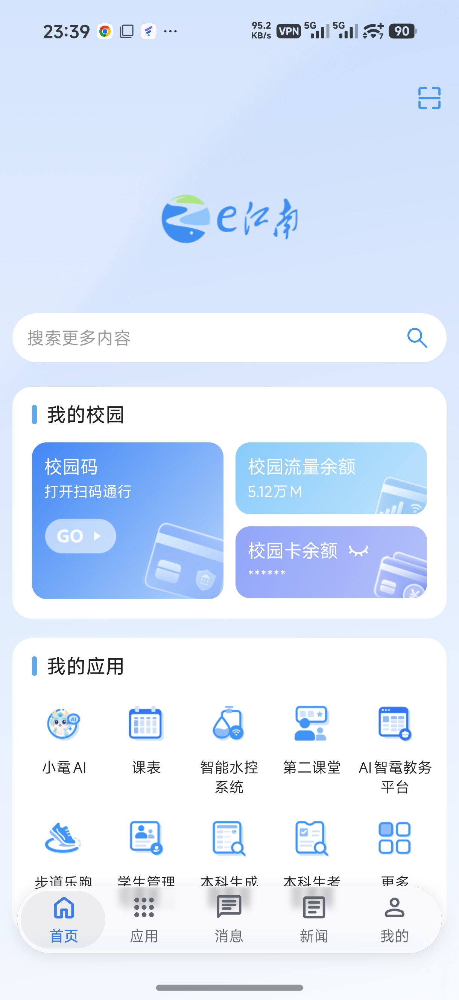
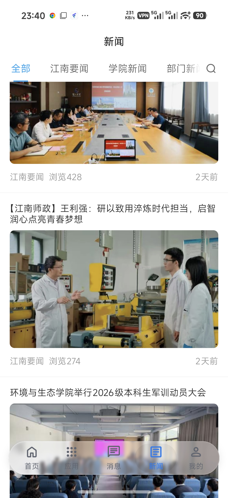
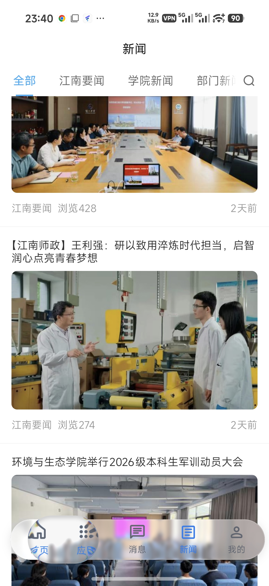

# e江南液态玻璃

使用 GPT-5.6 Sol 与 GPT-6 Astra Vibe Coding 得到的液态玻璃导航栏 Xposed 模块。

来源：上游 [WeChat-LiquidGlass](https://github.com/liuran001/WeChat-LiquidGlass)
开源项目。

## Description

使你的 e江南 App 看起来很高级。

## 效果预览

真实设备截图（e江南首页与新闻页）：

| 首页 | 新闻页 |
| --- | --- |
|  |  |

新闻页中的液滴选中与拖拽效果：



## 功能

- 作用域和运行时 allow-list 都只有 `com.wisedu.cpdaily.jiangnan`。
- 仅作用于 `com.wisedu.cpdaily.jiangnan`。
- 在 e江南原生 `tl_nav` 容器内注入独立液态玻璃导航栏。
- 使用 Google Material Symbols Rounded 图标。
- 支持五项页面切换、选中液滴、按压回弹和横向拖拽。
- 保留原生按钮作为页面切换代理，不复制业务逻辑。
- 原生底栏视觉层透明化，页面内容扩展到释放区域。
- 适配 Android 14 / HyperOS 手势导航，不覆盖系统小白条。

包名：`org.orynnx.liquidejnu`\
应用名：`e江南液态玻璃`

## 构建

无需 Gradle / Android Studio：

```bash
./setup-tools.sh
./build.sh
```

产物：`LiquideJNU-vX.Y.Z.apk`。默认使用临时 debug key；正式发布时通过环境变量
传入 keystore：

```bash
KEYSTORE=/path/to/release.jks \
KEYSTORE_PASS='...' KEY_ALIAS='...' KEY_PASS='...' ./build.sh
```

## License

本项目按 [MIT License](LICENSE) 分发。上游版权声明保留；e江南适配代码也按 MIT
License 发布。
